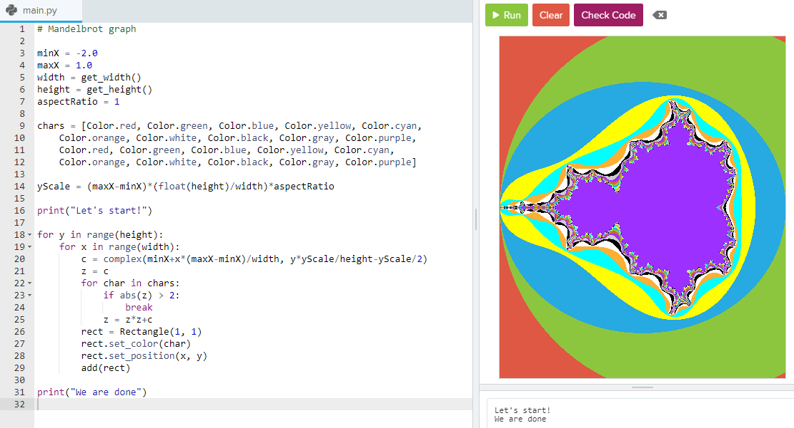

# AP Computer Science Principles

## 8.10.8 Guess the Passcode

This is a fun activity. I tried to alter it and not to just check sequentially, but with random numbers. The result looks like this:

```
Is Random faster? Let's run this 100 times!

......................................................................................
Results:
Could not crack it:    14 times.
Random was faster:     39 times.
Sequential was faster: 47 times.
 
```

The whole program is

``` py
"""
 Write a program that guesses every possible 4 digit passcode
 combinations until the correct passcode is guessed.

 The passcode is randomly generated and stored in the variable
 secretPasscode.

 Print out how many guesses it took to guess the correct passcode.
"""
import random

# Checks whether the given guess passcode is the correct passcode
def is_correct(guess_code, correct_code):
    return guess_code == correct_code

# Generates a random 4 digit passcode and returns it as a String
def generate_random_passcode():
    random_passcode = ""
    
    for i in range(4):
        random_digit = random.randint(0, 9)
        random_passcode += str(random_digit)
    return random_passcode

secret_passcode = generate_random_passcode()
# Write your code here

print("Is Random faster? Let's run this 100 times!\n")
nr_random = 0
nr_sequence = 0
nr_notfound = 0
for cycle in range(100):
  secret_passcode = generate_random_passcode()
  for i in range(50000):
      x = random.randint(0, 9999)
      if is_correct(str(x), secret_passcode):
          print(".", end='')
          break  
  if i == 49999:
      nr_notfound += 1
  else:
    if x > i:
        nr_random += 1
    else:
        nr_sequence += 1

print("\nResults:")
print('Could not crack it:    ' + str(nr_notfound) + ' times.')
print('Random was faster:     ' + str(nr_random) + ' times.')
print('Sequential was faster: ' + str(nr_sequence) + ' times.')

```

## 3.7.8 Mandelbrot graph - crashing CodeHS

The code is rather short:

``` py
minX = -2.0
maxX = 1.0
width = get_width()
height = get_height()
aspectRatio = 1

chars = [Color.red, Color.green, Color.blue, Color.yellow, Color.cyan,
    Color.orange, Color.white, Color.black, Color.gray, Color.purple,
    Color.red, Color.green, Color.blue, Color.yellow, Color.cyan,
    Color.orange, Color.white, Color.black, Color.gray, Color.purple]

yScale = (maxX-minX)*(float(height)/width)*aspectRatio

for y in range(height):
    for x in range(width):
        c = complex(minX+x*(maxX-minX)/width, y*yScale/height-yScale/2)
        z = c
        for char in chars:
            if abs(z) > 2:
                break
            z = z*z+c
        rect = Rectangle(1, 1)
        rect.set_color(char)
        rect.set_position(x, y)
        add(rect)
```

And the result speaks for itself:


