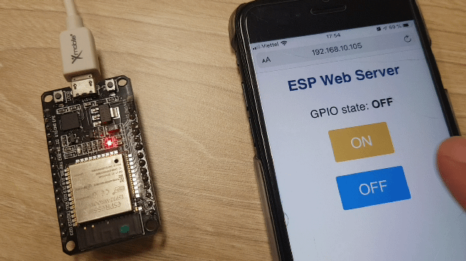

# Python 2018

Just a documentation of my first steps in python from 2018 on. It started with the workshop during the *BeTogetherConverence* at AIS on *November 16, 2018*.

## January 2020

The first [T400](https://github.com/kreier/T400) robot is running with Micropython!

## December 2019

Now python runs on esp8266 and esp32 as well. With REPL you see the result immideately.

It is also possible to compare the code in python and Arduino C accross devices. 

### Prime numbers to 10000

Time in milliseconds.

| unit         | esp8266 | esp32 | esp32 | raspberry pi 4 | Xeon X5550  |
|--------------|---------|-------|-------|----------------|-------------|
| MHz          | 40      | 40    | 240   | 1400           | 3060        |
| milliseconds | 24746   |       | 8012  | 215            | 16          |
| ms in C      |         |       | 2516  |                |             |

### Web server on esp8266 and esp32

Simple project, located in [micropython/webserver](micropython/webserver) and copied from [RandomNerdTutorials](https://randomnerdtutorials.com/esp32-esp8266-micropython-web-server/) it takes 10 minutes to create a local webserver:

## December 2018

No need to install software, you can use python in a Jupyter notebook with graphical output. Here I used pyplot in [this basic example](https://github.com/kreier/python2018/blob/master/basics/first.ipynb).

## November 2018

My first [Hello World!](https://github.com/kreier/python2018/blob/master/basics/hello-world.py) and [calculating prime numbers](https://github.com/kreier/python2018/blob/master/basics/prime-numbers.py) worked well.
